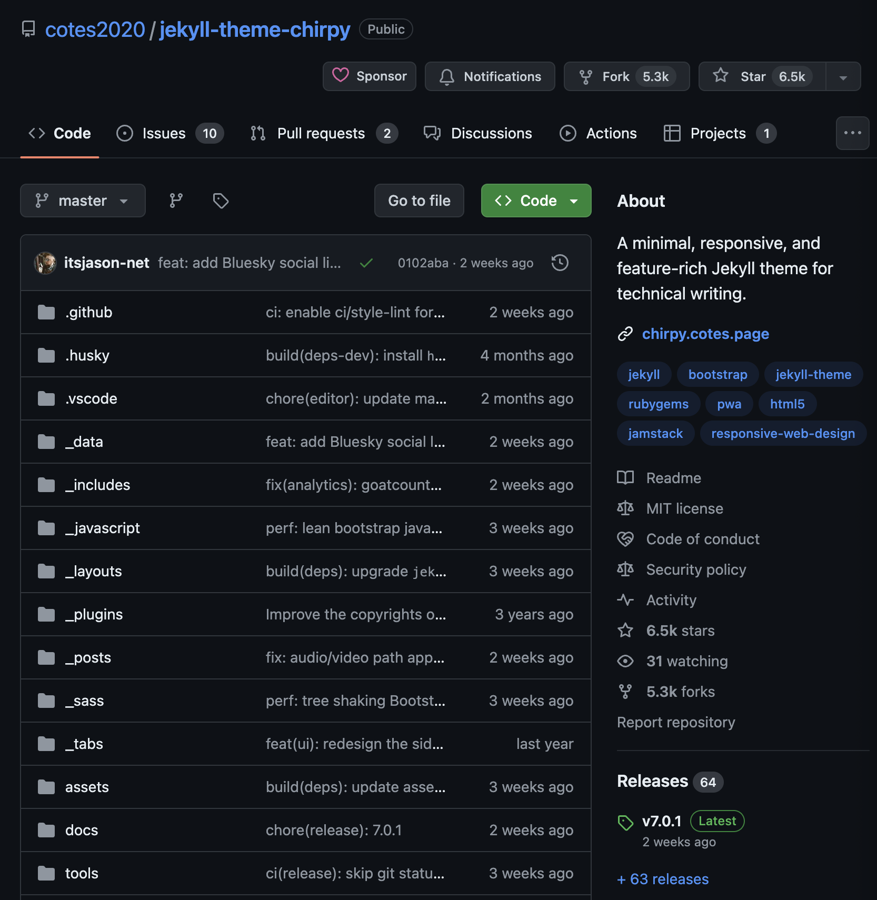

# **Jekyll Setup from Scratch**

This is a guide to help install Jekyll from scratch. I decided that I would like to have a better way to share my random projects and installs in my homelab that I attempt. I am by no means a professional in these areas and there are some options I still don't fully understand. I want to layout what worked for me and what I did along the way (through some bumps) to maybe explain some of things to help others. 

## What is Jekyll and why did you choose it?

Knowing I wanted to create a static website (no backend database), there were a few options out there. Hugo was mentioned a lot, and so was Jekyll. Jekyll had a pretty good community of documentation from what I could quickly see so thats it.

Jekyll is a static site generator, basically generates the website content for you without a backend to wrrry about. It's all prebuilt pages, so more secure and faster. This post is being written in Markdown and will be generated nicely by the time your seeing it. It runs on ruby, which I do not know but like I said the community support is great. So lets get started


## My setup
This will vary, but overall should be consistent. I decided to run this locally off my Macbook Air M2, which has been flawless. Lets break down the steps:


### <u>Step 1: Install Homebrew, Ruby, & Jekyll</u>
Grab the latest Ruby update, using homebrew. If you have homebrew running, you can skip the first couple commands here.

```bash
/bin/bash -c "$(curl -fsSL https://raw.githubusercontent.com/Homebrew/install/HEAD/install.sh)"
```

It may take some time for this to complete, and once its done we can verify its up and install ruby.

```bash
brew doctor
```
You may get some warnings, as I did, but otherwise your ready for the next step of installing Ruby. 

```bash
brew install chruby ruby-install
```
This will use Homebrew to install chruby (Ruby environment Manager) and ruby-install which we will use to go select our version. 

Now were ready to install ruby. While I am using an older version, I will attempt to upgrade shortly and provide an update on that. For now, installing an older version has been fine and a quick search hasn't shown any concerns with vulerabilities. 

So installing ruby now is just simple as
```bash
ruby-install 3.1.3
```
Now we need append chruby.sh and auto.sh (ruby version script) to our .zshrc file. If your not using the defautl Z-Shell in MacOS, then modify as necessary. 

```bash
echo "source $(brew --prefix)/opt/chruby/share/chruby/chruby.sh" >> ~/.zshrc
echo "source $(brew --prefix)/opt/chruby/share/chruby/auto.sh" >> ~/.zshrc
```

Lastly, let's set the default Ruby version for the shell, again appending to the .zshrc file. 

```bash
echo "chruby ruby-3.1.3" >> ~/.zshrc
```
 Once it's all finished, you can now intall Jekyll with bundler (the dependency manager for ruby projects)

 ```bash
 gem install jekyll bundler
 ```

By installing both Jekyll and Bundler, you'll have everything you need to start building and managing Jekyll-based websites effectively.

### <u>Step 2: Install Chirpy</u>

Chirpy is a simple blogging Jekyll theme. It has option of dark/light mode with search capability and so far I have liked its simplicity. Plus, its super easy to get started and setup with. 

Here is the [Github page](https://github.com/cotes2020/jekyll-theme-chirpy#quick-start) you will need to visit once your logged in.

