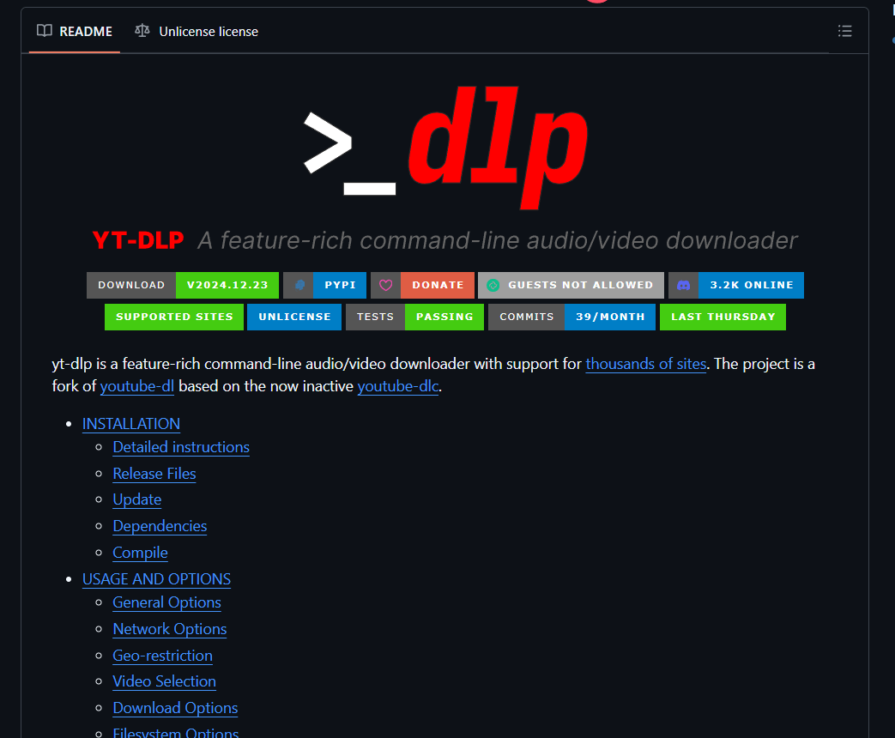

# **yt-dlp**

This is a guide I built that I thought would be helpful in utilizing a tool that was not designed by me. I am in no way affiliated or approve of using the tool for copyrighting purposes. 

## Why You Should Use <u>yt-dlp</u>##
yt-dlp is a powerful command-line tool designed to download videos and audio from various online platforms, most notably YouTube

## What is yt_dlp and why did you choose it?



## My setup
This will vary, but overall should be consistent. I decided to run this locally on my Windows 11, but inside my Ubuntu WSL. If interested in installing wsl-subsystem for Linux on Windows check out my [post.](https://crtcards1.github.io)

### <u>Step 1: Update and install <b>yt-dlp</b></u>
Grab the latest Ruby update, using homebrew. If 

```bash
sudo apt update
sudo apt install -y yt-dlp
```

Thats it, now you have it installed and ready to go. I am only focusing on audio but it can download video as well. There are a lot of options that I am sure you'd be able to find more advanced write-ups on. I simply wanted to pull some audio from videos and save into mp3 format. 

```bash
yt-dlp -x --audio-format mp3 URL
```
If you are presented with a cookie error, I would suggest using Get cookies.txt LOCALLY extension in the chrome browser, open up youtube, and download the cookies from the browser. Then instead run this command to allow the cookies to be used.

```bash
yt-dlp -x --audio-format mp3 "URL" --cookies /path/to/cookies.txt
```

Thats it, now it'll start downloading and you'll see your saved mp3. Note, my WSL hangs up for a second at the end so I just press enter and then it gives the terminal back.

If you want to test it quickly from the terminal, use mpg123.

```bash
sudo apt install mpg123 -y
mpg123 Name_of_File.mp3
```

You can also use it to download playlist. Simply put the playlist URL and not the individual video URL at the end. Thats it!.

