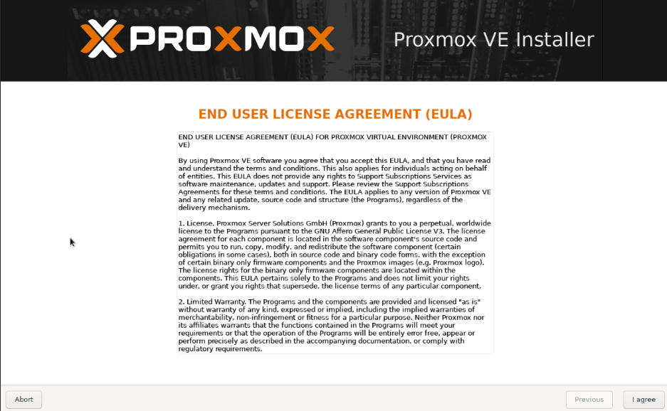
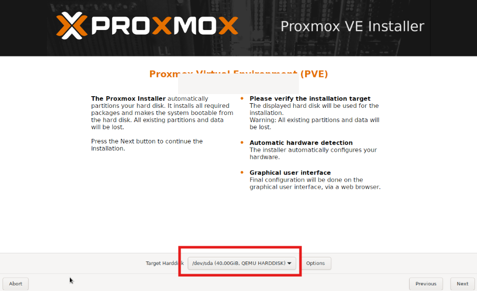
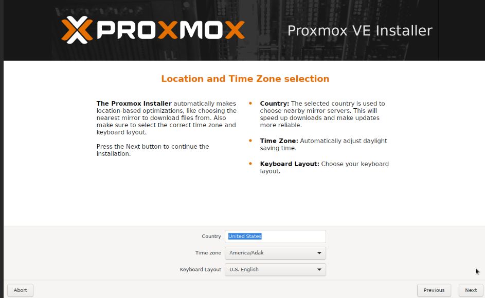
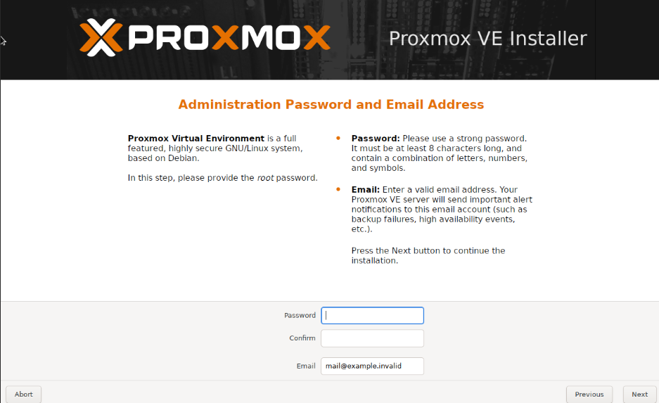
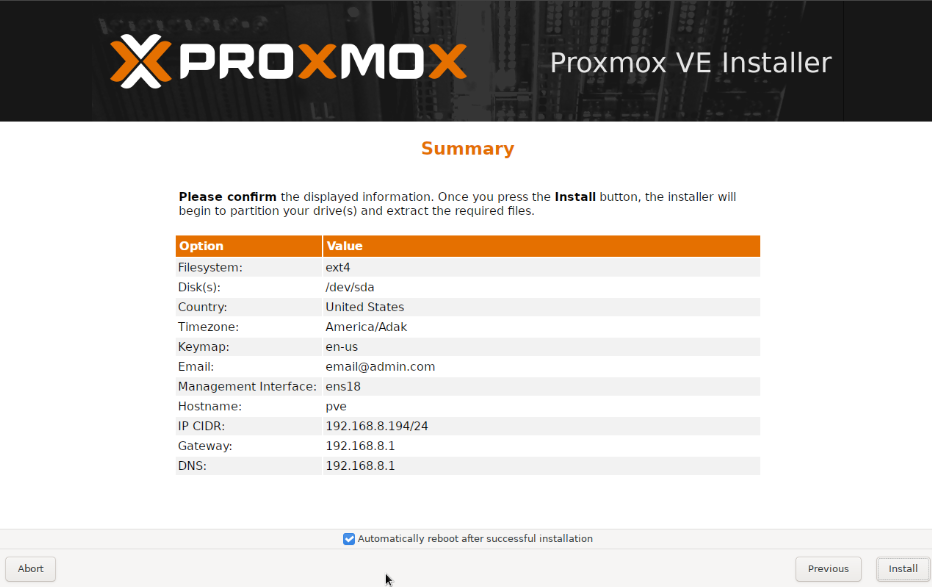
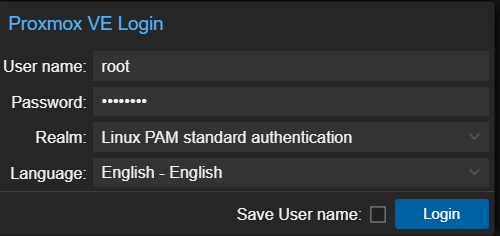

# **Proxmox**


Heres a guide to help those looking to install Proxmox. Proxmox is a super handy tool if you're running a homelab or just like messing around with virtual machines at home. It lets you run multiple operating systems on one physical machine using either full virtual machines or lightweight containers. The best part is it has a clean web interface, so you can manage everything from your browser — start, stop, clone VMs, take snapshots, and even back them up. You can also set up storage how you like and run different setups for testing or learning without needing a bunch of separate computers. And since it's free and open-source, it's great for DIY projects without spending a ton.

## Why You Should Use <u>Proxmox</u> ##
I use Proxmox because it makes it really easy to run and manage multiple virtual machines or containers on one computer. It’s perfect for my home lab and testing out different setups without needing a bunch of extra hardware — plus, it’s free and the web interface is super user-friendly.

## My setup
I set up Proxmox on my beelink NUC to create a compact yet powerful virtualization environment for my home network. The process was straightforward: I installed Proxmox directly onto the NUC, which is connected to my home network via Ethernet for stable access. After installation, I configured the web interface to manage virtual machines and containers seamlessly. This setup has been perfect for running a homelab, testing new software, and experimenting with different operating systems without needing additional hardware. 

# Installing Proxmox VE on a Device

This guide walks you through installing **Proxmox Virtual Environment (VE)** on a physical device.

---

## 🧰 Requirements

- A physical machine (x86_64 architecture)
- At least 2GB of RAM (4GB+ recommended)
- A bootable USB drive (at least 1GB)
- Proxmox VE ISO image: [Download Here](https://www.proxmox.com/en/downloads)

---

## 📥 Step 1: Download the Proxmox VE ISO

1. Visit the official [Proxmox download page](https://www.proxmox.com/en/downloads).
2. Download the latest **Proxmox VE ISO Installer**.

---

## 🔥 Step 2: Create a Bootable USB Drive

Use a tool like [Rufus](https://rufus.ie) (Windows) or `dd` (Linux/macOS) to create a bootable USB.

### On Windows (Rufus)

1. Open Rufus.
2. Select your USB device.
3. Choose the Proxmox ISO you downloaded.
4. Click **Start** and wait for completion.

### On Linux/macOS (Terminal)

```bash
sudo dd if=/path/to/proxmox-ve.iso of=/dev/sdX bs=4M status=progress && sync
```

## 🖥️ Step 3: Boot from USB

Plug the USB into the target machine.

Power it on and enter the BIOS/UEFI menu (commonly F2, F10, F12, or DEL).

Set the USB as the primary boot device.

Save and exit BIOS.

## ⚙️ Step 4: Install Proxmox VE
When the installer loads, select "Install Proxmox VE".

Accept the EULA and proceed.


Choose the target hard disk to install Proxmox on.


**Configure:** Country, time zone, and keyboard layout

Administrator password and email

Network settings (hostname, IP address, gateway, DNS)

**Hostname:** Default value is fine, but if your using your own DNS domain here is where you want to change that. 

**IP Address:** This is the management IP you will use to interact with your Proxmox server.

**Gateway/DNS:** Likely this is your router. 

Click Install and wait for the process to complete.



## ✅ Step 5: First Login
After installation, remove the USB and reboot.

After installation, remove the USB and reboot.

On a different machine, open a browser and go to:

```cpp
https://<your-proxmox-ip>:8006
```
Login with:

```bash
Username: root
Password: (the one you set during installation)
```


## 🎉 You're now ready to start building your Proxmox VE environment!

